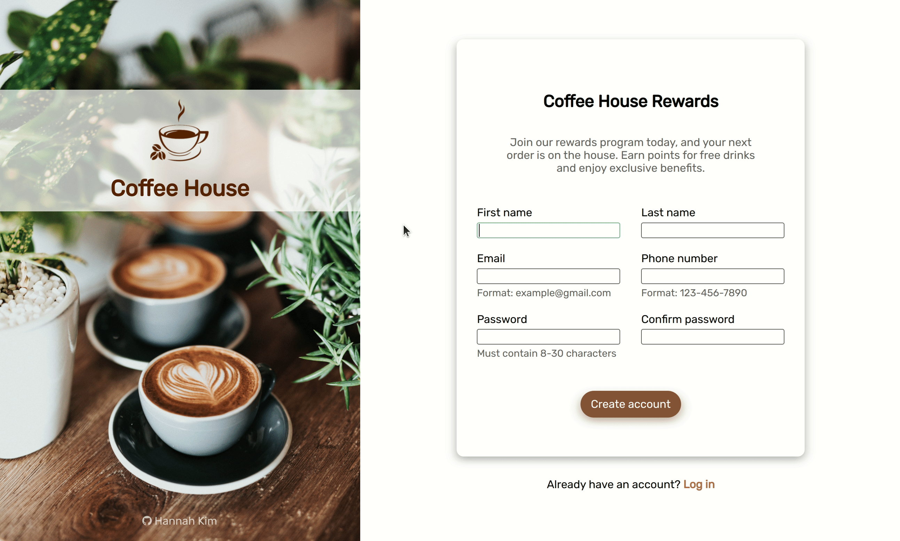

# Sign-up Form

https://hannahkim313.github.io/sign-up-form/

## Summary

This project exercise, created by The Odin Project, is an example of a sign-up
form for an imaginary coffee shop's rewards program. With a main emphasis on
both form and input elements, the final outcome reflects my understanding of
intermediate CSS concepts through a simple UI.

## In Action

### Form Demonstration

### Responsiveness Demonstration

## Goals

My ultimate goals for this project are to create a well-designed sign-up form
by implementing intermediate CSS concepts. I want to expand my CSS skills
by utilizing concepts such as advanced selectors, functions, and custom
properties to achieve a sign-up form that is both functional/responsive and
coherent in terms of design.

## Credits

* [Coffee photo](https://unsplash.com/photos/zUNs99PGDg0) by [Nathan Dumlao](https://unsplash.com/@nate_dumlao)
on Unsplash
* [Coffee logo](https://www.pngwing.com/en/free-png-vnpae) on PNGWing